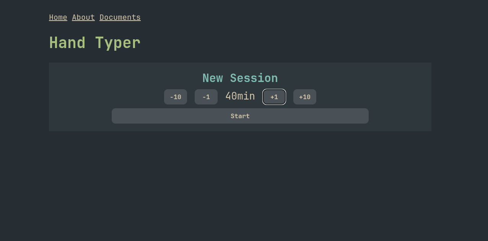
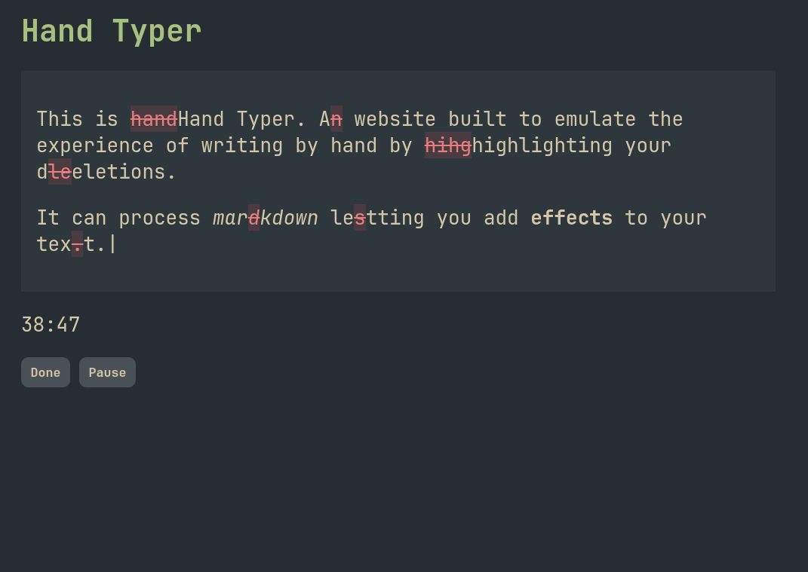
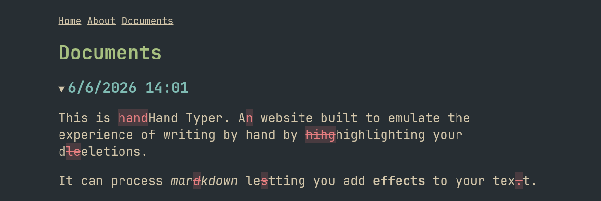

# Hand Typer

Text editor software that places restrictions on text deletion to force chronological editing. This will help build the skills for typing coherent essays without relying on the advantages of digital tools for fast iteration.

Made for hackclub horizons!

## Premise

A text editor that attempts to mimic the limitations of writing on paper.

Hand Typer places restrictions on text editing to force chronological typing. This will help build the skills for typing coherent Hands by hand without relying on the advantages of digital tools for fast iteration.

I made this as a tool to try to help with my school work while writing essays and to learn javascript :)

## Screenshots

## Features

- Choose the length of your writing session
- You may only delete your last keystrokes.
- No editing previous paragraphs.
- Saves documents to local browser storage
- Markdown rendering support
- Autosaves your session unless you accidentally close the window

## Technologies

- Written in pure HTML, CSS, Javscript
- Hosted on Github Pages
- [Showdown](https://github.com/showdownjs/showdown) markdown conversion

## Credits

- [Everforest colourscheme](href="https://github.com/sainnhe/everforest") by sainnhe

## TODO

- [x] Prototype in plain html/css/javascript
- [x] Deleting generating strikethrough markdown
- [x] [Render markdown](https://marked.js.org/) and hide textarea. 
- [x] Timer
- [x] Starting session menu
- [x] Saving each session
- [x] Pausing and resuming timer
- [x] Ending timer early
- [x] Closed tab session recovery
- [ ] Deleting sessions from documents tab
- [ ] Exporting sessions without deletions
- [ ] Settings: 
    - [ ] Most dangerous writing app mode

## Similar Projects

- [The most dangerous writing app](https://en.wikipedia.org/wiki/The_Most_Dangerous_Writing_App)

